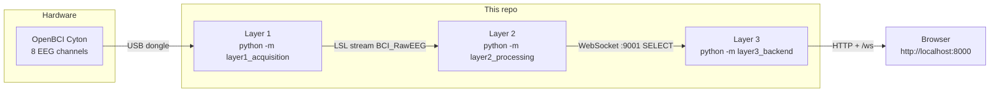

# Noor: gaze at 6 Hz or 15 Hz, speak a command

## A real-time SSVEP communicator on an 8-channel OpenBCI Cyton — not a Quest app, not a speller-with-Gemini, not a downloadable end-user product

Noor is a three-process Python stack that turns looking at a flickering tile into a confirmed action. An OpenBCI Cyton streams 8-channel EEG. Filter-bank CCA (FBCCA) decides whether the wearer is watching the **6 Hz** tile or the **15 Hz** tile. After **five consecutive** detections at the same frequency, a browser UI treats that as a deliberate choice: pick a need on the home list, ask for food or water, call a caregiver, speak a wheelchair direction, or spell a word letter by letter. Optional ElevenLabs TTS reads the result aloud.

There is one way to run it: install this repo, start the three layers in order, open the page.



**6 Hz** is SELECT (confirm / left action). **15 Hz** is NEXT (advance / right action). Those two frequencies are the entire control scheme.

---

## How to run it

You need **Python 3.11+**, an **OpenBCI Cyton** with USB dongle, eight electrodes on the Cyton N1P–N8P pins, and a **60 Hz** display so 6 Hz and 15 Hz land on whole frames.

Default Cyton wiring in `configs/cyton_default.yaml` (CH1 → row 0):

| Cyton pin | Label |
|---|---|
| N1P | O1 |
| N2P | O2 |
| N3P | Pz |
| N4P | P3 |
| N5P | P4 |
| N6P | C3 |
| N7P | C4 |
| N8P | T5 |

GND and REF go on the Cyton bias pins, not on N1P–N8P. Impedance must be under **10 kΩ** on every labeled channel or Layer 1 will refuse to start.

**1. Install from this repo** (run from the project root):

```powershell
pip install -e .
```

**2. Match sample rates.** Layer 1 defaults to **250 Hz**. Layer 2’s YAML still says **500 Hz**, and Layer 2 trusts that number for filters, epoch length, and FBCCA — it does not adopt the LSL advertised rate. Set `sample_rate_hz: 250` in `configs/layer2_default.yaml` before you start.

**3. Start the three processes**, Layer 1 first so the LSL stream exists:

```powershell
# Terminal 1 — EEG onto LSL (replace COM3 with your dongle port)
python -m layer1_acquisition --serial-port COM3

# Terminal 2 — classify 6 Hz vs 15 Hz, broadcast SELECT on ws://localhost:9001
python -m layer2_processing

# Terminal 3 — bridge + UI
python -m layer3_backend
```

On Windows, the COM port is under Device Manager → Ports. Speech needs a key in the same terminal as Layer 3:

```powershell
$env:ELEVENLABS_API_KEY = "your-key"
python -m layer3_backend
```

Without that key the UI still navigates; `/api/speak-text` returns 503.

**4. Open [http://localhost:8000](http://localhost:8000).** Sit still, look at one flickering tile until its streak hits **5 / 5**. The page then fires:

| Page | 6 Hz (SELECT) | 15 Hz (NEXT) |
|---|---|---|
| Home | Enter the highlighted item | Move the highlight (wheelchair → food → water → caregiver → spell) |
| Wheelchair | Speak “Move backward” | Speak “Move forward” |
| Food / water / caregiver | Return home | Speak that request |
| Spell | Pick the shown letter, backspace, or Done | Cycle A–Z, then ⌫, then Done |

Layer 1 also appends raw µV to `recordings/session.csv` by default. That file grows quickly.

---

## Known issues

- **Sample-rate mismatch.** `configs/cyton_default.yaml` is 250 Hz; `configs/layer2_default.yaml` is 500 Hz. FBCCA, notch/bandpass, and 2-second epochs all use the Layer 2 YAML value. Align them or classification is wrong.
- **Flicker is not vsync-locked.** Tiles toggle in `requestAnimationFrame`, so the on-screen frequency is approximate. A 60 Hz panel is still the right target; a 90/120 Hz headset is not part of this repo.
- **ARCHITECTURE.md is a design sketch.** It describes Meta Quest 3, Gemini word prediction, TRCA, xDAWN, SQLite audit logs, and endpoints this codebase does not implement. The live classifier is FBCCA only. The live frontend is the browser page above. Wheelchair “control” is spoken text, not a motor bus.
- **TTS is optional and rate-limited.** No `ELEVENLABS_API_KEY` means no audio. The server also enforces a short per-IP cooldown on speak endpoints.
